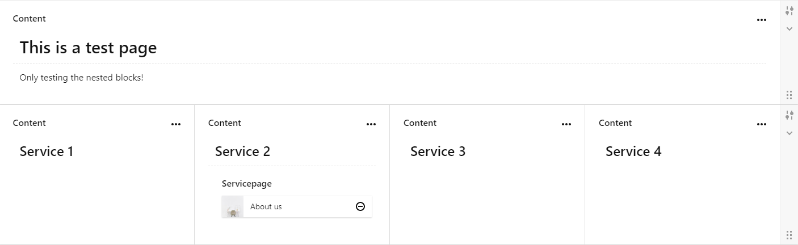
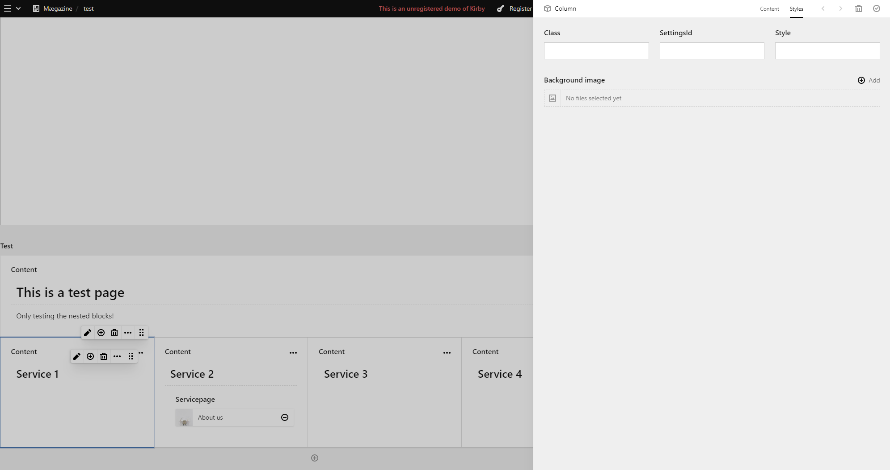

# Seperate settings on columns (with Kirby Blocks)

With the current layout- and blocks-system it is not possible to get seperate settings per column
and maintaining an okay workflow in the panel.
First idea was to nest layouts in layouts but this was not really practical.

The current idea is to have a layout that is able to span mutliple rows and represents a section wrapper.
Inside these rows are column-blocks which have seperate settings and another inner-block that represents the content of the column.


## Layout organisation:
- Section (type: layout)
  - has settings per se from layout
  - represents rows / section
- Row (represented by sections)
  - possible to get seperate settings per row by adding multiple sections
```yaml
name: Rows
type: layout
layouts:
  - "1/1"
  - "1/2, 1/2"
  - "1/4, 1/4, 1/4, 1/4"
  - "1/3, 2/3"
  - "2/3, 1/3"
  - "1/3, 1/3, 1/3"
  - "1/1, 1/2, 1/2"
settings:
  fields:
    class:
      type: text
      width: 1/2
    id:
      type: text
      width: 1/2
    image:
      label: Background image
      type: files
fieldsets:
  column:
    extends: blocks/column
```
- Column (type: blocks)
  - inner content (type: blocks)
    - is a nested block that gets rendered later on
  - possible to get seperate settings with a custom tab
```yaml
name: Column
preview: fields # required for nested blocks preview (Kirby-Fields-Block Plugin)
wysiwyg: true # required for nested blocks preview (Kirby-Fields-Block Plugin)
label: false
max: 1
tabs:
  content:
    fields:
      text:
        label: Content
        type: blocks
        fieldsets:
          - text
          - heading
  styles:
    fields:
      class:
        type: text
        width: 1/3
      settingsId:
        type: text
        width: 1/3
      style:
        type: text
        width: 1/3
      image:
        label: Background image
        type: files
```




## Features

- full preview in panel
- seperate settings for rows / columns

## Problems
- little bit clunky when using multiple blocks in one column

## Rendering of content
Template for column.yml:
```html
<div class="<?= $block->class()?>" style="<?= $block->style() ?>" id="<?= $block->settingsId() ?>">
  <?= $block->content()->text()->toBlocks() ?>
</div>
```